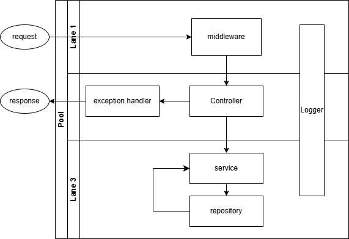
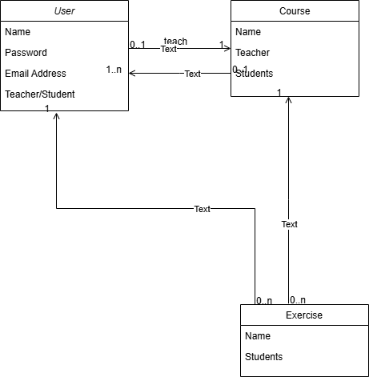

# ht06-nodejs-swagger

---

## Features

-   **Student testing application number 6**
-   **Purpose**: Implement RESTful API. Developing web application on Node.js. Description and technical design REST API
-   **Result**: Define endpoints API, codes of response

-   **Modern Backend Stack**:
    -   **Express** server wrapper application
    -   **MongoDB** Database framework
    -   **typeScript** javaScript typed builder
    -   **Swagger** providing REST API endpoints

---

## Task Description

An educational platform with the ability to view and edit media content.
Users can edit and view created courses.
Users can create their own courses.
Courses contain a description and sets of lessons.
The list and description of all courses (as well as a description of lessons) are available to all users.
It is also possible to add comments to a lesson and see comments from other users.
Each lesson can contain a description, video, links, files as another type of resource.
In order for a user to have access to lessons of a non-own course, the course author can add the user to the list of allowed accounts.

## The application MUST

store a course that has a description, examples of input and output data, difficulty level, tags (for example, "algorithms", "data structures",
"dynamic programming"), additional materials (files, links)
provide the ability to login and logout
contain user roles (user, administrator, author) and check whether the user has certain permissions in the system; users must be able to
leave comments on the course, lessons and add comments; users can rate the course and classes, which helps other participants understand the complexity and interestingness; users should be able to see the profiles of authors and courses, edit their rating;
contain a REST API for managing application resources
use a database to store information about tasks, users

## Application workflow diagram


## Application entity diagram


## Quick Start

### Prerequisites


```
cd <project_name>
npm install
npm run tsc
```

## Checking how it works

**Used Insomnia (https://insomnia.rest/)**

```
request : POST : localhost:8000\users\register
data : 
{
"email": "evgeny@idva.ee",
"password": "131",
"name": "EPups",
"teacher": false
}
```

```
request : POST : localhost:8000\users\login
{
"email": "evgeny@idva.ee",
"password": "131",
} 
```

**Used MongoDB Compass(mongosh)**

```
db.users.find()


{
  _id: ObjectId('67582bfaecf06103c78dfbb7'),
  email: 'evgeny@idva.ee',
  password: '$2a$10$iTjbwElOCtWjshX7BazWtOtWCQRt9sOpZ4PsnWQueHJ4th71iwYea',
  name: 'EPups',
  createdAt: 2024-12-10T11:54:34.110Z,
  updatedAt: 2024-12-10T11:54:34.110Z,
  __v: 0
}
```
**Check Rest API endpoints with swagger** 

use http://localhost:8000/api-docs/

